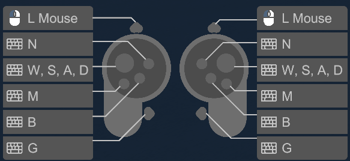

# Exemples
- Scene démo de Unity : [DemoScene](Assets/Samples/XR%20Interaction%20Toolkit/3.1.2/Starter%20Assets/DemoScene.unity)

# Simulation d'équipement VR
- Il est possible de simuler un équipement VR en ajoutant le prefab [XR Device Simulator](Assets/Samples/XR%20Interaction%20Toolkit/3.1.2/XR%20Device%20Simulator/XRDeviceSimulator/XR%20Device%20Simulator.prefab) dans votre scène.
    - Caméra : représente la tête de l'utilisateur.
        - Déplacer la souris pour contrôler la rotation de la caméra et des contrôleurs.
        - Tenir clic droit pour contrôler la caméra seulement.
    - Contrôleurs : représentent les mains de l'utilisateur.
    
        - Tenir Shift gauche pour contrôler le contrôleur gauche.
        - Tenir la barre d'espace pour contrôler le contrôleur droit.
        - Tenir le clic du milieu pour déplacer un contrôleur en 2D.
    - Appuyer sur V pour réinitialiser la position et la rotation des appareils.

# Liens utiles
- Documentation officielle : [XR Interaction Toolkit](https://docs.unity3d.com/Packages/com.unity.xr.interaction.toolkit@3.4/manual/index.html)
- Tutoriels vidéo : [How to Make a VR Game in Unity](https://www.youtube.com/watch?v=HhtTtvBF5bI&list=PLpEoiloH-4eP-OKItF8XNJ8y8e1asOJud)
- Cours par Unity : [Create with VR](https://learn.unity.com/course/create-with-vr)
